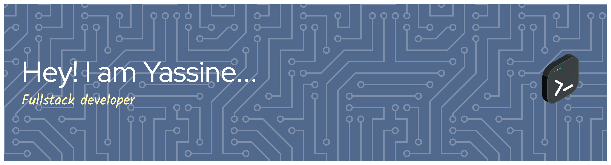

<!-- Add your background image URL as a cover image -->

🎓 I hold a Bachelor's Degree in Computer Science from Université Paris-Est Créteil (UPEC).  
🤝 **Open for collaborations!** Actively looking for contributors and collaborators on open-source & engineering projects.  
🌐 Passionate about full-stack software architecture, mobile development, and ethical hacking/security.

---

### 🛠️ Tech Stack & Skills

**Languages**  

**Backend & APIs**  

**Frontend & Mobile**  

**Databases & Storage**  

**DevOps, Infrastructure & OS**  

**Security & Environment**  

---

### 🔭 Current Projects
- **Softora:** Freelance web & platform development for clients.

---

### 📫 Let's Connect
- **Discord:** Feel free to reach out for project collaboration or networking!

---

*Feel free to explore my repositories, submit a PR, or drop a star ⭐ if you find my work useful!*
### 📫 Let's Connect
- **Discord:**(yassdudix) Feel free to reach out for project collaboration or networking!

---

